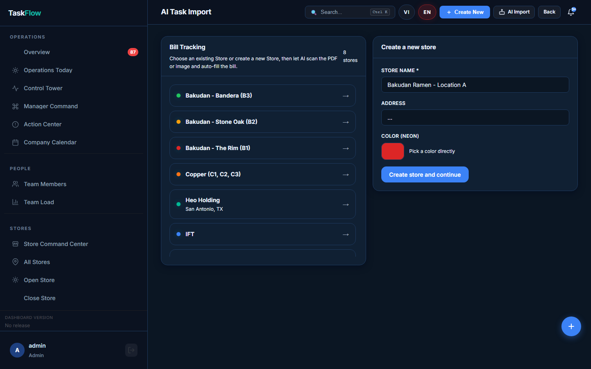
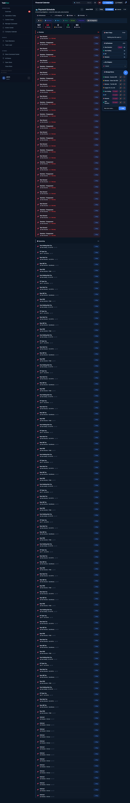
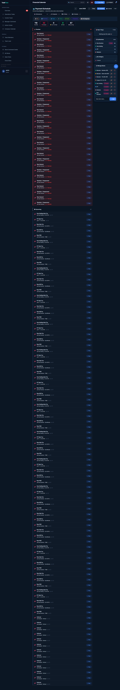

# Bill System Verification Report
**Date:** 2026-06-10  
**Environment:** Production (dashboard.bakudanramen.com)  
**Tested by:** Admin (manual QA)

## Phase I — CEO Bill Import (AI Import)

**URL:** `/ai-import/bills`

**UI Verification:** ✅ PASS  
- Page loads showing all 8 stores
- Store list: Bakudan-Bandera (B3), Bakudan-Stone Oak (B2), Bakudan-The Rim (B1), Copper (C1,C2,C3), Heo Holding, IFT, Modesto, Raw Stockton
- "Create a new store" panel on right side
- Each store links to bill import flow

**AI Scan Flow:** ⚠️ PENDING  
- Full import flow (upload PDF → AI scan → auto-fill → save) not tested
- No bill documents available during QA session
- UI is functional but end-to-end import requires real bill PDFs

## Bill Category Drilldowns

| Category | Route | Status |
|----------|-------|--------|
| Rent | `/overview/drilldown/bills/category/rent` | ✅ PASS — 1 bill |
| Store 2 (Raw Stockton) | `/overview/drilldown/bills/store/2` | ✅ PASS — 132 bills |

## Bills Created During Bulk Import (from previous session)

All 9 bill categories were previously bulk-imported across all stores. The DailyDuplicateTaskBillScanner detected 8 duplicate groups from a multiplier=8 import error. See DUPLICATE_CLEANUP_PLAN.md for cleanup plan.

## UX Fixes Applied During QA

| Issue | Fix | Commit |
|-------|-----|--------|
| Date input didn't open picker on click | Added `showPicker()` on click event | d4a1fb4 |
| Calendar view had no month navigation | Added prev/next month nav inside calendar grid | d4a1fb4 |

## Screenshot Evidence (captured 2026-06-10)

### Phase I — AI Import UI

### Bills List (showing current state with duplicates)

### Bills Calendar View

## Result: PARTIAL PASS ⚠️
UI verified. AI scan end-to-end import pending bill document upload test.
