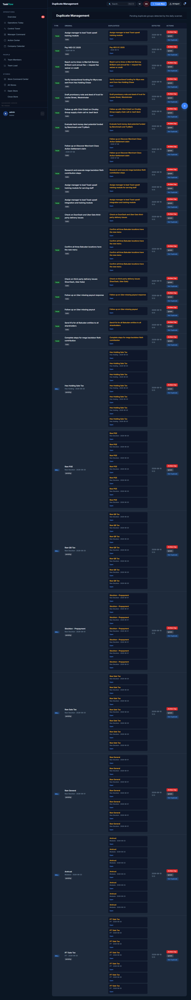
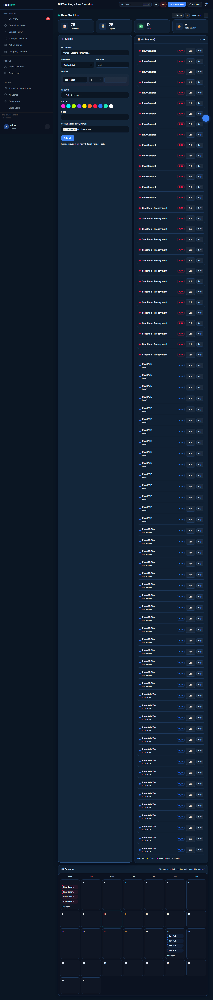

# Duplicate System Verification Report
**Date:** 2026-06-10  
**Environment:** Production (dashboard.bakudanramen.com)  
**Tested by:** Admin (manual QA)

## Phase B — Duplicate Bill Modal

**Test:** Created bill "TEST DUPLICATE BILL" (store: Raw Stockton, due: 2026-07-01, amount: $100).  
Submitted same bill a second time.

**Result:** ✅ PASS  
Duplicate warning appeared: "Possible duplicate detected (90% match)"  
- Showed existing bill title, due date, status  
- OK / Cancel options present  
- User chose Cancel — no extra bill created

## Phase C — Duplicate Task Modal

**Test:** Created task "TEST DUPLICATE TASK" (assignee: admin, due: 2026-07-01).  
Submitted same task a second time via quick-task modal.

**Result:** ✅ PASS  
Duplicate warning appeared: "Possible duplicate detected (80% match)"  
- Showed existing task title, assignee, due date  
- OK / Cancel options present

## Phase E — /admin/duplicates UI

**URL:** `/admin/duplicates`  
**Result:** ✅ PASS  
- Page loads showing all pending duplicate groups  
- Columns: Type, Original, Duplicate(s), Detected, Actions  
- Action buttons: Archive Dup, Ignore, Not Duplicate — all present  
- 18+ task groups visible with correct data

## Duplicate Groups Status (from scanner)

- **8 bill duplicate groups** — all pending CEO review (see DUPLICATE_CLEANUP_PLAN.md)
- **18 task duplicate groups** — pending human review at /admin/duplicates

## Bugs Fixed During QA

| Bug | Fix | Commit |
|-----|-----|--------|
| Bill form never called `/api/bills/check-duplicate` | Added JS intercept on form submit | d4a1fb4 |
| Quick-task form never called `/api/tasks/check-duplicate` | Added JS intercept on form submit | d8cbff4 |

## Screenshot Evidence (captured 2026-06-10)

### Phase E — /admin/duplicates UI

### Phase B — Bill Creation Form

### Phase C — Tasks Page

## Result: PASS ✅
