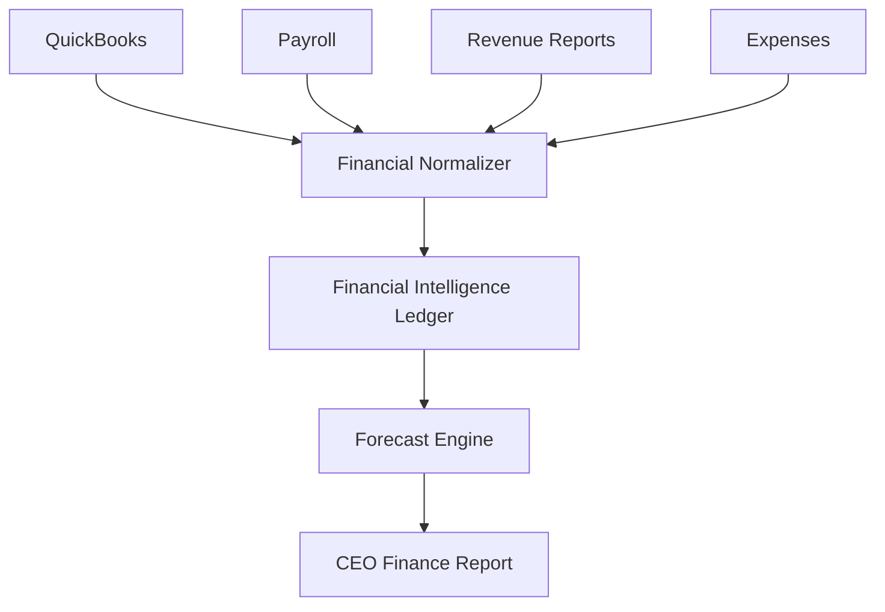

# CFO AI Engine

Phase: 53
Target: CFO_AI_READY

## Objective

Build financial intelligence for cash flow, profitability, labor, expenses, and store-level financial health.

## Sources

- QuickBooks
- payroll
- revenue reports
- expense reports
- store reports
- vendor invoices

## Architecture

CFO AI is a read-only advisory layer:

## Runtime

Initial runtime must not mutate QuickBooks, payroll, banking, vendor payments, or accounting records.

## Required Outputs

- cash position summary
- cash flow forecast
- labor cost trend
- store profitability
- expense anomaly
- financial risk level
- recommendation

## QA

Block CFO_AI_READY if:

- financial source date is stale
- totals cannot reconcile
- confidence is not shown
- recommendation lacks evidence

## Acceptance Test

CEO asks: "Cash flow thang nay sao?"

Mi returns cash state, forecast, risk, cause, recommendation, confidence, and source timestamps.

## Stress Test

Run scenarios with missing payroll, stale QuickBooks export, negative cash flow, and conflicting revenue files.

## Certification

CFO_AI_READY requires reconciliation evidence and executive acceptance report.

## Final Status

CFO_AI_DESIGN_READY

