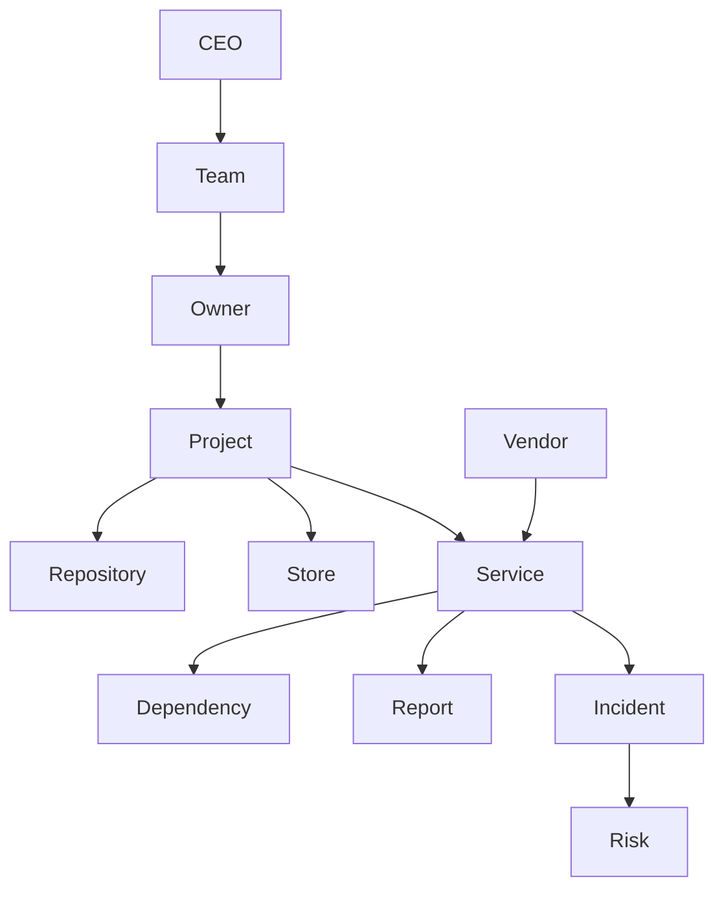

# Enterprise Twin Graph

Phase: 51

## Graph Model

## Node Types

- CEO
- team
- owner
- project
- store
- repository
- service
- dependency
- vendor
- report
- incident
- risk

## Edge Types

- owns
- operates
- contains
- depends_on
- reports_to
- affected_by
- fixed_by
- certified_by

## Required Queries

- Which services are single points of failure?
- Which projects depend on Mi-Core?
- Which owners are overloaded?
- Which reports certify this system?
- Which stores are affected by a dependency outage?

## Evidence Rule

No graph edge is trusted unless it has source evidence or is marked inferred with confidence.

## Final Status

ENTERPRISE_TWIN_GRAPH_DESIGN_READY

