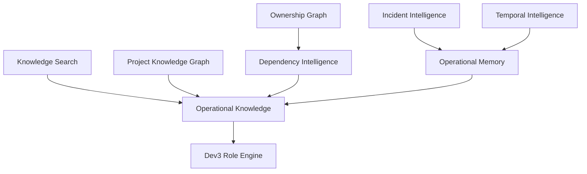

# KNOWLEDGE_UNIVERSE_V2_ARCHITECTURE

Generated: 2026-06-13
Status: KNOWLEDGE_UNIVERSE_V2_DESIGN_READY

## Directive Boundary

This is a future architecture design. No production rollout is approved.

The locked Dev3 integration APIs remain unchanged:

- `/api/execution-package`
- `/api/work-orders/enrich`
- `/api/projects/intelligence`
- `/api/skills/recommend`
- `/api/risks/classify`

## V2 Goal

Knowledge Universe V2 combines:

```text
Knowledge Search
+
Operational Knowledge
+
Knowledge Graph
+
Incident Intelligence
+
Operational Memory
+
Temporal Intelligence
```

## Architecture



## Layer Responsibilities

| Layer | Responsibility |
|---|---|
| Knowledge Search | Source-backed retrieval from reports, docs, logs, project files |
| Operational Knowledge | Stable package/enrichment contract for Dev3 |
| Project Knowledge Graph | Project, repository, dependency, service, owner, report traversal |
| Dependency Intelligence | Blast radius, critical path, single point of failure |
| Incident Intelligence | Recurrence, root cause, fix owner, fix duration |
| Operational Memory | Lessons from previous work orders, deployments, audits, fixes |
| Temporal Intelligence | What changed over time and when facts were valid |
| Ownership Graph | Owner, store, module, overload, unowned module analysis |

## Recommended Engine Split

| Need | Candidate |
|---|---|
| Durable project graph | Neo4j |
| Real-time in-memory dependency traversal | Memgraph |
| Temporal agent memory | Graphiti |
| Existing source-backed lookup | Current Knowledge Universe search |

## Migration Plan

Phase 0: Frozen contract protection

- Keep current APIs unchanged.
- Add no new production execution logic.
- Use reports and prototypes only.

Phase 1: Offline graph build

- Export current project seeds, graph entities, reports, and scanner output.
- Build Neo4j/Memgraph prototype locally.
- Validate Dashboard -> Review Automation -> Mi-Core traversal.

Phase 2: Read-only intelligence

- Run dependency, ownership, and incident queries from offline graph.
- Compare answers against current execution package outputs.
- Do not feed production API yet.

Phase 3: Temporal prototype

- Use Graphiti candidate for work order, incident, blocker, and ownership timelines.
- Validate weekly/monthly/90-day questions.

Phase 4: Approval gate

- Present benchmark and accuracy evidence to CEO.
- Only after approval, allow existing Operational Knowledge service to read from V2 graph as an internal source.

## Production Contract Strategy

Dev3 should continue consuming `/api/execution-package`. V2 graph layers should become internal evidence sources behind the package generator only after approval. Dev3 should not need to change its integration path.

## Status

KNOWLEDGE_UNIVERSE_V2_DESIGN_READY
