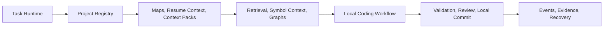

# Mi V1 Architecture

Mi v1 is a local-first foundation composed of five stable layers: task runtime, project registry, context and retrieval, coding execution, and validation/review.

## Runtime Layer

The task runtime owns task state, legal transitions, evidence capture, event history, read-only command execution, cancellation, and restart persistence. Commands use argv arrays and an allowlist. Evidence is referenced through sanitized relative IDs.

## Registry Layer

The Project Registry owns explicit project registration, project maps, map freshness, source SHA tracking, context packs, resume context, validation profiles, and project-scoped boundaries. It does not broad-scan or infer editable projects without registration.

## Context Layer

Context packs are built from fresh project maps plus targeted reads. Retrieval includes structural signals, route/import/dependency context, symbols, and explicit project-relative paths when the user or approved plan names an existing in-boundary file.

## Coding Layer

The active engine is `local-llm-engine`. The deterministic `internal-patch-engine` remains a fallback for narrow controlled tasks. Coding runs in isolated worktrees, records strategy/model events, and creates local-only commits after validation and review.

## Validation Layer

Validation profiles define language, framework, install/build/test/lint commands, artifact paths, generated output paths, cleanup policy, and success criteria. Validation distinguishes unchanged base checkouts from expected generated artifacts.

## Frozen Boundary

Task runtime contracts, registry contracts, retrieval, symbol context, AST editing, impact graph, validation profiles, and coding workflow are frozen for v1 stability. Future changes require a reproduced bug or approved compatibility need plus tests and regression evidence.
