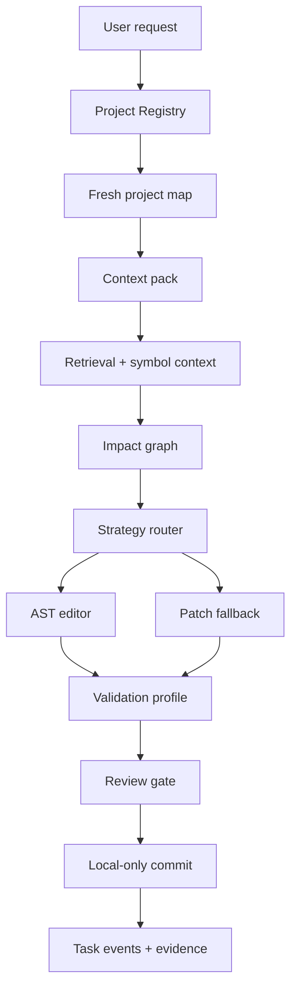

# Mi Personal OS v1.0.0

Release date: 2026-08-05

Final master SHA: `f8e9bfcb5d6a570171f6257258938a9daf7227bc`

Production build source SHA: `f8e9bfcb5d6a570171f6257258938a9daf7227bc`

## Release Definition

Mi Personal OS v1.0.0 is the stable local-first engineering and operational foundation for Mi. It closes Phase 4 with a durable task runtime, project registry, restart recovery, context packs, isolated coding worktrees, local model routing, retrieval, symbol context, AST-guided editing, impact analysis, validation profiles, review gates, local-only coding commits, CI scans, and real-world certification across Mi Core, Mi Academy, and Healthy-LD.

This release does not claim the full Jarvis-style personal assistant vision is complete. It establishes the dependable base that later personal context, planning, briefing, voice, and controlled operator layers must extend.

## Capabilities

- Durable task runtime with terminal state machine, evidence files, event timeline, and restart persistence.
- Project Registry with explicit project registration, maps, resume context, and context packs.
- Isolated local coding worktrees with local-only commit policy and no push, merge, or deploy capability.
- Local-first model routing through the offline coding engine.
- Structural retrieval, explicit project-relative path inclusion, symbol context, route/import/dependency graphs, and multi-file impact graph.
- AST-guided editing, compiler-guided type repair, behavior-preserving refactor support, patch fallback, validation, and review.
- Polyglot validation profiles for Node/TypeScript, Flutter/Dart, Python-style command contracts where configured, generated artifact classification, and dirty workspace protection.
- CI and local security gates including conflict marker scan, secret scan, build, unit/task-runtime/project-registry/coding tests, and acceptance.

## Architecture

## Security Boundaries

- Coding tasks run in isolated worktrees.
- Commands are allowlisted and executed without shell interpolation.
- Task-runtime public responses do not expose absolute evidence paths.
- Cloud fallback is disabled by default in production.
- OpenHands and Aider are not active execution engines in this release.
- The coding engine has no registered `git push`, PR merge, production deploy, email send, money movement, or publishing capability.
- Secrets, `.env`, generated files, and out-of-project paths remain excluded from context.

## Supported Project Types

- Node/TypeScript projects using npm install/build/test scripts.
- Flutter/Dart projects using configured Flutter validation commands.
- Projects with generated output when an explicit artifact policy declares allowed generated paths.
- Generic repositories through project maps and context packs when validation profiles are defined.

## Real Certification Results

- Mi Core: PASS, source SHA `f8e9bfcb5d6a570171f6257258938a9daf7227bc`, map `map-ab4891dd0a9b`, local-only commit `3972b10d52a121fa2c1c347c872282e57e146dc4`.
- Mi Academy: PASS, source SHA `3b65f14af08f137cc130be44a5043ab85c9738ca`, map `map-5fadfc47ce5a`, local-only commit `62ef9c403d3831f8fe180ce293fe3482d6fd3d8b`.
- Healthy-LD: PASS, source SHA `9044901c30024ee02a571c1197d00844f988fd37`, map `map-56711426f951`, local-only commit `216c3e37bad1e8aa8a2fbbc7156944c541aac4f2`.

## Model Roles

- Active coding engine: `local-llm-engine`.
- Production model roles at release: `coding_primary=qwen3:8b`, `coding_fast=qwen2.5-coder:7b`, `coding_review=qwen3:8b`.
- Locality: `local-first`.
- Cloud fallback: disabled.

## Hardware And Runtime Assumptions

- Windows host with Node.js, npm, PM2, Git, Flutter/Dart where Flutter projects are certified, and local Ollama models installed.
- Production process: PM2 `mi-core`.
- PM2 cwd: `D:\Project\Mi-core-system\Master\mi-core`.
- PM2 script: `D:\Project\Mi-core-system\Master\mi-core\server\dist\index.js`.

## Startup And Health

- Build: `cd server && npm ci && npm run build`.
- Start/restart production: `pm2 restart mi-core`.
- Health: `GET /api/health`.
- Tool surface: `GET /api/tools`.
- Protected coding surface: `GET /api/coding/engines` and `GET /api/coding/models` with `x-api-key`.

## Backup And Restore

The v1.0.0 deployment created a predeploy backup under:

`D:\mi-core-pm2-backups\v1-predeploy-20260805-095014`

Restore by copying the backed-up `server\dist` contents back to the live `server\dist`, then restarting only `mi-core`.

## Known Limitations

- Personal long-term memory beyond project/task context is not complete.
- Daily personal briefing is not complete.
- Email/calendar operational intelligence is not complete.
- General desktop operator and voice interface are not complete.
- Autonomous external publishing, push, merge, deployment, money movement, and unrestricted computer control are not enabled.
- Production-grade multi-agent goal execution remains future work.

## Emergency Stop

Stop or restart only the PM2 process named `mi-core`. Do not reset, clean, or switch the dirty live checkout as part of emergency recovery. Restore the latest timestamped `server\dist` backup if a deployment fails.

## Approval Policy

External actions remain approval-gated or disabled. The v1.0 coding path may create local commits inside isolated task worktrees, but it must not push, merge, deploy, publish, email, or move money.

## Roadmap

The next approved work is Phase 5A only: personal context, goals, and daily operating loop. Voice, unrestricted desktop control, autonomous external actions, and Phase 5B+ are out of scope for the first Phase 5 slice.
