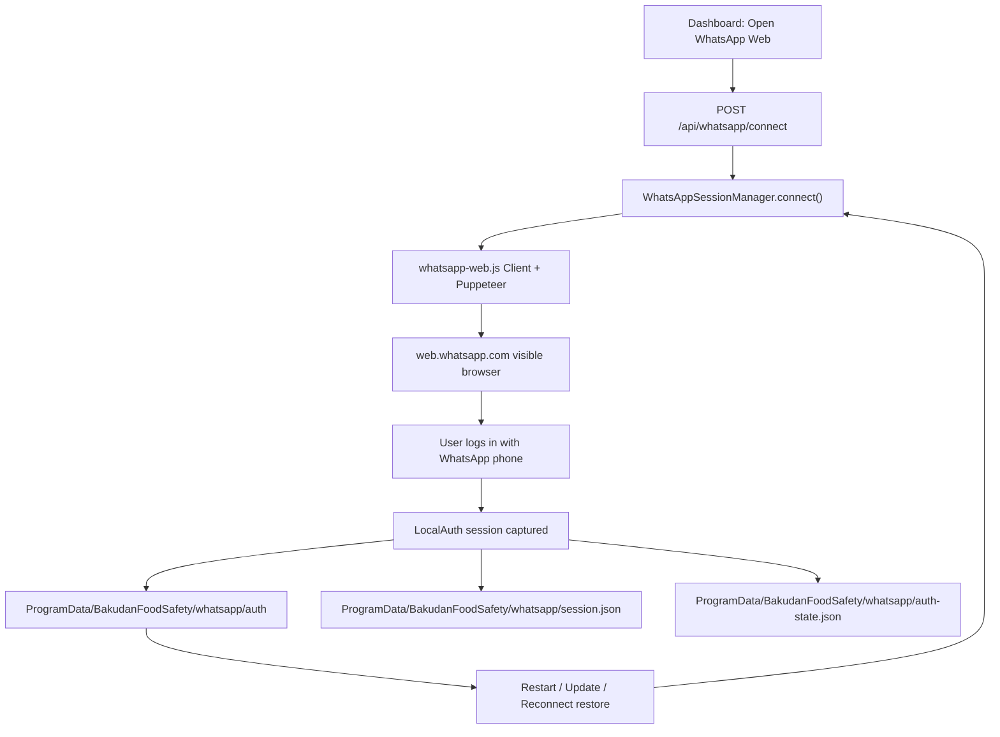

# WhatsApp Web Session Flow Report

Date: 2026-06-10

## Verdict

Status: BLOCKED FOR CEO PASS.

Code/runtime changes are in place, but CEO PASS requires a phone-side login and proof that the session survives restart, laptop reboot, application update, and network reconnect. That evidence cannot be completed without logging in through WhatsApp on the target machine.

## Root Cause

The previous dashboard made QR login the primary user experience. QR generation worked, but the flow was fragile because QR state refreshed frequently, remote users could not easily scan, and dashboard troubleshooting depended on an embedded QR block.

## Files Changed

- `src/whatsapp/session-manager.js`
- `src/api/server.js`
- `src/dashboard/admin-ui.js`
- `installer/install.ps1`
- `.env.example`
- `pack.ps1`
- `pack.sh`

## Session Architecture

## What Changed

- Added `WhatsAppSessionManager` with:
  - `connect()`
  - `disconnect()`
  - `reconnect()`
  - `healthCheck()`
  - `saveSession()`
  - `restoreSession()`
  - `clearSession()`
- Added API endpoints:
  - `POST /api/whatsapp/connect`
  - `POST /api/whatsapp/reconnect`
  - `POST /api/whatsapp/disconnect`
  - `POST /api/whatsapp/clear-session`
- Dashboard now shows:
  - Connect WhatsApp / Open WhatsApp Web
  - Reconnect WhatsApp
  - Disconnect WhatsApp
  - Session Status
  - Last Connected
  - Account Name
  - Phone Number
  - Session Age
  - Reconnect Count
- Removed QR from the default header card.
- QR remains available only under `Emergency QR fallback`.
- Installer stores WhatsApp runtime session under:
  - `C:\ProgramData\BakudanFoodSafety\whatsapp\auth`
  - `C:\ProgramData\BakudanFoodSafety\whatsapp\cache`
- Existing legacy sessions are migrated from:
  - `.wwebjs_auth`
  - `.wwebjs_cache`
  - `data/session`

## Reconnect Logs

Observed local runtime after restart:

- `legacy_session_migrated`
- `initializing`
- `connection_status: RECONNECTING`
- then `connection_status: AUTH_REQUIRED`

This means the old local session was not valid anymore and a fresh WhatsApp Web login is required.

## Restart Validation Proof

Completed:

- Gateway restarted through `scripts/windows/start-gateway-hidden.ps1`.
- `/api/health`: HTTP 200.
- `/api/whatsapp/status`: HTTP 200.
- Dashboard rendered with `Open WhatsApp Web`.
- Dashboard did not render embedded QR in the header.

Not completed:

- `CONNECTED / READY` after phone login.
- Restart after successful phone login.

## Update Validation Proof

Partially completed:

- Installer config now stores sessions in ProgramData, outside the replaceable app folder.
- Installer migrates old app-folder sessions before replacing the app folder.

Not completed:

- Live update after successful WhatsApp login.
- Proof that `READY` survives update.

## Tests

- `node --check src/whatsapp/session-manager.js`: PASS
- `node --check src/api/server.js`: PASS
- `node --check src/dashboard/admin-ui.js`: PASS
- `installer/install.ps1` parse: PASS
- `npm test`: PASS
- Runtime `/api/health`: PASS
- Runtime `/api/whatsapp/connect`: PASS
- `whatsapp-ai-gateway-windows-installer.zip`: rebuilt
- Outer installer zip scan: PASS
- Nested production source zip scan: PASS
- Dashboard HTML:
  - `Open WhatsApp Web`: present
  - `WhatsApp Session`: present
  - embedded header QR: absent
  - `Scan to connect`: absent
  - emergency QR fallback: present only when auth is required

Package scan confirmed no `.env`, secrets, logs, `data/whatsapp`, `session.json`, `auth-state.json`, DB files, browser profile files, or stale Google test/log URLs in the outer installer zip or nested production source zip.

## Known Blockers

- Phone-side WhatsApp Web login still required to reach `AUTHENTICATED` and `READY`.
- Cannot mark CEO PASS until a real phone login is completed and survives restart/update/network reconnect.

## Final Status

FAIL/BLOCKED for CEO acceptance.

Reason: implementation is ready, but required live evidence is incomplete.
