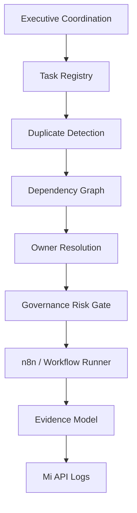

# Workflow Dependency Graph

Status: READY

## Critical Dependencies

| workflow | upstream | downstream | risk |
|---|---|---|---|
| `seo-daily-audit` | Google credentials, crawler, GSC, GA4 | weekly SEO report, CEO status | SAFE_WRITE |
| `quickbooks-daily-sync` | QuickBooks connector | finance summaries, anomaly detection | FINANCIAL |
| `review-monitoring` | review connector | marketing summaries, owner alerts | PRODUCTION_WRITE |
| `food-safety-daily-reminder` | food safety schedule | operator reminder, evidence capture | PRODUCTION_WRITE |
| `mi-system-health-check` | PM2/Mi health endpoints | CEO status, engineering alerts | READ_ONLY |

Dependency gaps:
- Documented workflows now have machine registry IDs.
- Workflow dependency graph is enforced at Phase 0.7 contract level; deeper per-step n8n edge enforcement can be added after runtime rollout.
